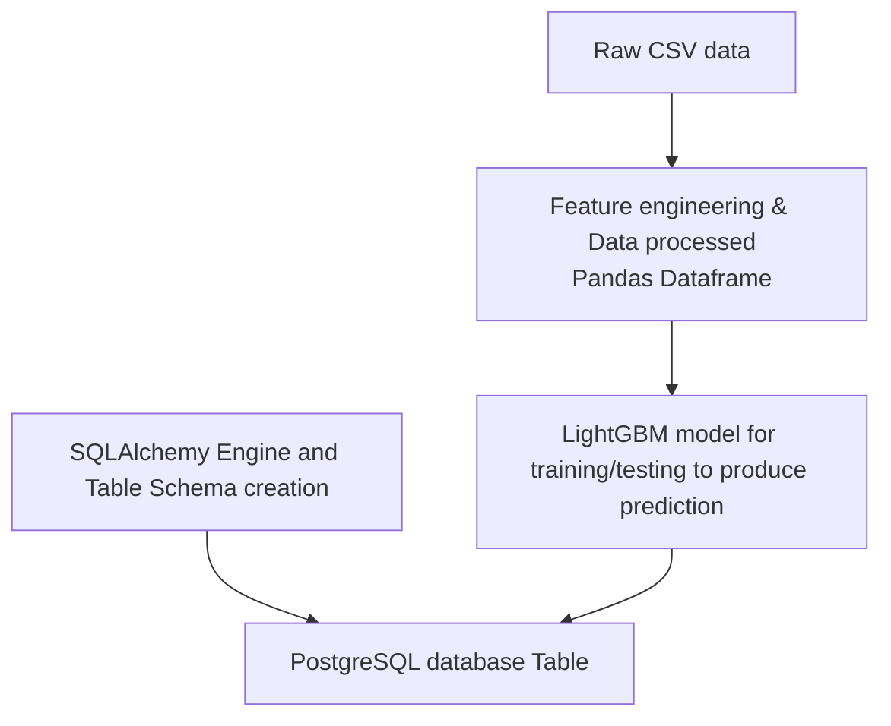

                                     NYC-Taxi-Etl-ml-Pipeline Project

This project aims to give financial estimations of the cost of a service based on multiple features/variables that 
are extracted from a raw .csv file. In data engineering, raw operational data must be reliably transformed into a structured, low-latency insights that can then be used for applications. This project builds an end-to-end 
pipeline that ingests raw NYC taxi records that looks at important features (such as rush hour,passenger count,traffic,fixed airport fare zones), and trains a LightGBM regressor model to predict the taxi fares. To 
ensure results can meet industry standards, the information is sent through a pipeline connected to a containerized  PostgreSQL database using SQLAlchemy.

Tech Stack

Programming lanauges: 
* Python 3.13
* SQL

Data processing:
* Pandas 3.0.3
* NumPy

Machine Learning :
* LightGBM 
* Scikit-learn

Databases:
* PostgreSQL
* SQLAlchemy

Containterization:
* Docker, Docker compose

Key Features and Decision Explinations

Pipeline Architecture:
* Project is broken into multiple files to make debugging, prevents easier as well as
  more orgainized.

Spatial & Temporal Feature Engineering:
* Used the given longitude and latitude to calculated total distance travelled using haversine formula 
  as well as if the taxi was headed to any airport charging a fixed fare. Also used the given time to 
  determine things like rush hour, night time driving, weekday vs weekend etc.

ML model:
* Used the LightGBM regressor since it predicts continous numerical results based on the given input features

Database Management:
* SQLAlchemy was used to tranlate the python code to be used towards the PostgreSQL table. Docker was used 
  to ensure that if the project worked on my device, it would work on anyone elses device. One single command is
  all thats needed to launch the project and database.

                            Project Structure

  | File/Folder | Purpose|
  | :--- | :--- |
  | `src/database.py` | PostgreSQL connection is created & its table |
  | `src/etl.py` | Feature Engineering and Pandas Data processing |
  | `src/model.py` | Model gets trained and produces fare prediction |
  | `docker-compose.yml` | PostgreSQL database container configuration
  | `main.py` | Main end-to-end pipeline that connects multiple files to work together |    
  | `requirements.txt` | All the external libaries used
  | `README.md` | Project Documentation

                        Quickstart & Setup
    To run the pipeline locally:

  1. Clone the repository
    
   git clone [https://github.com/aiman6ix/nyc-taxi-etl-ml-pipeline.git](https://github.com/aiman6ix/nyc-taxi-etl-ml-pipeline.git)

    cd nyc-taxi-etl-ml-pipeline

  2. Set up the virtual environment
    python -m venv venv
    source venv/bin/activate  
    pip install -r requirements.txt

   3. Start the PostgreSQL database container:
    docker compose up -d

   4. Run the pipeline:
    python main.py